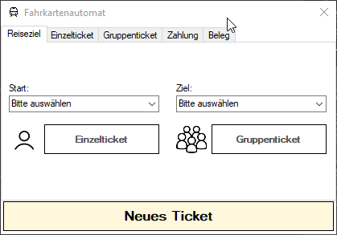

# Ticketautomat

Die App ermöglicht es den Benutzern, Fahrkarten für Zugreisen zu kaufen. Es gibt verschiedene Tabs, die verschiedene Schritte des Kaufprozesses darstellen.

Der **"Start Tab"** ist der erste Tab, den die Benutzer sehen. Dort können sie ihre Abfahrts- und Ankunftsstadt auswählen. Sobald sie dies getan haben, können sie entweder eine Einzelfahrkarte oder eine Gruppenfahrkarte auswählen und zum nächsten Tab gehen.

Im **"Einzelticket Tab"** können die Benutzer ihre Passagierart (Erwachsener, Kind oder ermäßigt) und ihre BahnCard-Ermäßigung (0%, 25% oder 50%) wählen. Wenn sie auf "Weiter" klicken, gelangen sie zum "Zahlungsart Tab".

Im **"Gruppenticket Tab"** können die Benutzer die Anzahl der Erwachsenen, Kinder und ermäßigten Fahrgäste in ihrer Gruppe angeben. Es müssen mindestens 5 Fahrgäste vorhanden sein, um ein Gruppenticket kaufen zu können. Wenn sie auf "Weiter" klicken, gelangen sie zum "Zahlungsart Tab".

Im **"Zahlungsart Tab"** können die Benutzer die gewünschte Zahlungsart auswählen: Bargeld, EC-Karte oder Kreditkarte. Sobald sie die Zahlungsart ausgewählt haben, gelangen sie zum letzten Tab.

Im **"Quittung Tab"** wird eine Zusammenfassung der Reiseinformationen und der Preise angezeigt. Hier können die Benutzer ihre Quittung sehen und den Kaufvorgang abschließen.

Es gibt auch einige Funktionen, die den Benutzern helfen, die richtigen Eingaben zu machen. Zum Beispiel werden in den Textfeldern für die Anzahl der Fahrgäste nur Zahlen zugelassen. Es gibt auch Überprüfungen, um sicherzustellen, dass die Benutzer die erforderlichen Informationen eingeben, bevor sie zum nächsten Schritt gehen können.

### Struktogramm
</img>

### Programm Demo
</img>

## Programmbestandteile
Der Code enthält mehrere Dateien, die jeweils verschiedene Aufgaben erfüllen. Hier sind die wichtigen Punkte:

Die Datei "City.vb" enthält Informationen über verschiedene Städte, wie ihren Namen, Breitengrad und Längengrad. Dies hilft dabei, die Entfernung zwischen den Städten zu berechnen.

Die Datei "Passenger.vb" repräsentiert einen Fahrgast und enthält Informationen über den Typ des Fahrgasts (Erwachsener, Kind oder ermäßigt) sowie Informationen über die Bahncard des Fahrgasts.

Die Datei "Results.vb" speichert die Ergebnisse der Fahrpreisberechnung. Hier werden die Preise für verschiedene Fahrgasttypen, Rabatte und andere Informationen gespeichert.

Die Datei "Utils.vb" enthält verschiedene nützliche Funktionen, die von der App verwendet werden. Diese Funktionen ermöglichen es beispielsweise, den Tabelleninhalt zu ändern, Dropdown-Listen zu füllen, Rabatte zu berechnen und vieles mehr.

### Utils.vb
Die "Utils.vb"-Datei enthält verschiedene Hilfsfunktionen, die von der Anwendung verwendet werden.

Die Datei enthält Funktionen, die den Benutzern bei der Navigation in den Tabs helfen, Dropdown-Listen mit Städten füllen, die Berechnung der Entfernung zwischen Städten ermöglichen und Preise für Fahrkarten berechnen.

Die Funktion "disable_all_pages" deaktiviert alle Tabs in einem TabControl. Das bedeutet, dass die Benutzer nicht auf die Tabs klicken können.

Die Funktion "select_tab" aktiviert einen bestimmten Tab in einem TabControl und zeigt ihn an.

Die Funktion "populate_dropdown" füllt eine Dropdown-Liste mit Städtenamen, wobei ein bestimmter Wert ausgeschlossen werden kann.

Die Funktion "verify_group_ticket_bahncards" überprüft, ob die Anzahl der Rabattkarten für Gruppentickets korrekt eingegeben wurde.

Die Funktion "load_cities_from_file" liest Städteinformationen aus einer Datei und gibt sie als Liste zurück.

Die Funktion "get_passenger_list" erstellt eine Liste von Fahrgästen basierend auf den eingegebenen Informationen wie Anzahl der Passagiere, Anzahl der Rabattkarten usw.

Die Funktion "BerechneEntfernung" berechnet die Entfernung zwischen zwei Städten unter Verwendung geografischer Koordinaten.

Die Funktionen "get_km_preis", "get_kind_rabatt", "get_erm_rabatt" und "get_gruppen_rabatt" geben verschiedene Preise und Rabatte zurück, die für die Berechnung der Fahrpreise verwendet werden.

Die Funktion "get_payment_method_fee" gibt eine Gebühr für verschiedene Zahlungsmethoden zurück.

Die Funktion "calculate_prices" berechnet die Preise für Fahrkarten basierend auf der Entfernung zwischen den Städten und den Eigenschaften der Fahrgäste.

Das sind die wichtigsten Funktionen in der "Utils.vb"-Datei. Es gibt noch weitere Funktionen, die technische Aspekte behandeln, aber diese wurden hier weggelassen, um es verständlicher zu machen.

### Types.vb
Die "types.vb"-Datei definiert zwei Aufzählungstypen (Enums), nämlich "PassengerType" und "PaymentType".

Der "PassengerType" (Fahrgasttyp) definiert verschiedene Arten von Fahrgästen, die in der Anwendung vorkommen können. Es gibt drei Arten: Erwachsene, Kinder und Ermäßigte.

Der "PaymentType" (Zahlungstyp) definiert verschiedene Arten von Zahlungsmethoden, die in der Anwendung verwendet werden können. Es gibt drei Arten: Bargeld, EC-Karte und Kreditkarte.

Diese Enums werden in anderen Teilen des Codes verwendet, um den Typ von Fahrgästen oder den Zahlungstyp zu spezifizieren. Sie helfen bei der Kategorisierung und Verarbeitung der Daten in der Anwendung.

### Results.vb
Die "Results.vb"-Datei definiert eine Klasse namens "Results" (Ergebnisse).

Die "Results"-Klasse enthält verschiedene Eigenschaften und Variablen, um Ergebnisse und Informationen zu speichern. Sie wird verwendet, um die Ergebnisse einer Berechnung in der Anwendung zu halten.

Folgende Informationen werden in der "Results"-Klasse gespeichert:

Die regulären Preise für Erwachsene, Kinder und ermäßigte Fahrgäste.
Die berechneten Preise für Erwachsene, Kinder und ermäßigte Fahrgäste.
Die Rabatte für Erwachsene, Kinder und ermäßigte Fahrgäste, die sich aus den regulären Preisen und den berechneten Preisen ergeben.
Der Gruppenrabatt, der auf die Gesamtzahl der Fahrgäste angewendet wird.
Die Anzahl der Erwachsenen, Kinder und ermäßigten Fahrgäste.
Die Gesamtsumme der berechneten Preise.
Die Gesamtsumme der regulären Preise.
Die Gesamtsumme der Rabatte.
Diese Informationen werden verwendet, um die berechneten Preise, Rabatte und andere relevante Daten für die Anwendung darzustellen und anzuzeigen.

### Passenger.vb
Die "Passenger.vb"-Datei definiert eine Klasse namens "Passenger" (Fahrgast).

Die "Passenger"-Klasse repräsentiert einen Fahrgast und enthält Informationen über den Typ des Fahrgasts und die Bahncard-Rabattstufe, die der Fahrgast hat.

Ein Fahrgast hat zwei Eigenschaften:

"Typ": Diese Eigenschaft gibt den Typ des Fahrgasts an, wie zum Beispiel Erwachsener, Kind oder ermäßigter Fahrgast.
"Bahncard": Diese Eigenschaft speichert den Rabattwert der Bahncard für den Fahrgast. Die Bahncard ist eine spezielle Karte, die Rabatte auf Bahnfahrten gewährt. Der Rabattwert wird als Dezimalzahl dargestellt, zum Beispiel 0.25 für 25% Rabatt.
Die "Passenger"-Klasse hat einen Konstruktor, der beim Erstellen eines neuen Fahrgasts aufgerufen wird. Der Konstruktor erwartet den Fahrgasttyp und den Bahncard-Rabattwert als Parameter und weist diese den entsprechenden Eigenschaften zu.

Diese Klasse wird verwendet, um Informationen über die Fahrgäste in der Anwendung zu speichern und zu verwalten.

### City.vb

Die "City.vb"-Datei definiert eine Klasse namens "City" (Stadt).

Die "City"-Klasse repräsentiert eine Stadt und enthält Informationen über den Namen der Stadt sowie deren geografische Koordinaten (Breitengrad und Längengrad).

Eine Stadt hat drei Eigenschaften:

"Name": Diese Eigenschaft speichert den Namen der Stadt.
"Lat": Diese Eigenschaft speichert den Breitengrad der Stadt als Dezimalzahl.
"Lon": Diese Eigenschaft speichert den Längengrad der Stadt als Dezimalzahl.
Die "City"-Klasse hat einen Konstruktor, der beim Erstellen einer neuen Stadt aufgerufen wird. Der Konstruktor erwartet den Namen der Stadt sowie deren Breiten- und Längengrad als Parameter und weist diese den entsprechenden Eigenschaften zu.

Diese Klasse wird verwendet, um Informationen über Städte in der Anwendung zu speichern und zu verwalten. Sie kann verwendet werden, um Städte anhand ihres Namens und ihrer geografischen Koordinaten zu identifizieren.
