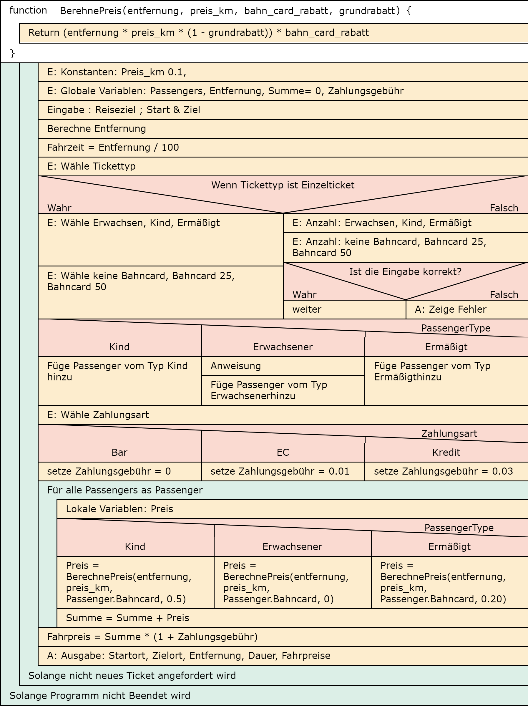

# Ticket Machine

`Ticket Machine` is a VB.NET Windows Forms app that simulates a train ticket vending machine. It guides users through selecting a route, choosing passengers and discounts, picking a payment method, and reviewing a receipt.

## Features
- City-based routing with distance-driven pricing
- Single and group tickets (group minimum: 5 passengers)
- Passenger types: adult, child, reduced
- BahnCard discounts: 0%, 25%, 50%
- Payment methods: cash, EC card, credit card
- Input validation and guided tab navigation

## User Flow (Tabs)
1. **Start**: Select departure and arrival city, then choose single or group ticket.
2. **Single Ticket**: Pick passenger type and BahnCard discount.
3. **Group Ticket**: Enter passenger counts and BahnCard counts per type.
4. **Payment**: Choose payment method.
5. **Receipt**: Review trip summary and total pricing.

## Validation Rules
- Passenger count fields accept digits only.
- Departure and arrival must be selected and must be different.
- Group tickets require at least 5 passengers.
- BahnCard counts cannot exceed passenger counts.

## Demo & Diagram
### Structure Diagram
</img>

### App Demo
</img>

## Project Structure
- `app/` - VB.NET solution root
- `app/Ticketautomat.sln` - Visual Studio solution
- `app/App.vb` - main form and UI flow logic
- `app/Util.vb` - helpers for tab navigation, dropdowns, pricing, validation
- `app/Types.vb` - enums for passenger and payment types
- `app/City.vb` - city model (name + coordinates)
- `app/Passenger.vb` - passenger model (type + BahnCard)
- `app/Results.vb` - pricing calculation result model
- `app/Cities.txt` - city list with coordinates

## Build & Run
- Requirements: Windows + Visual Studio with .NET Framework 4.8.
- Open `app/Ticketautomat.sln`, build, and run the project.
